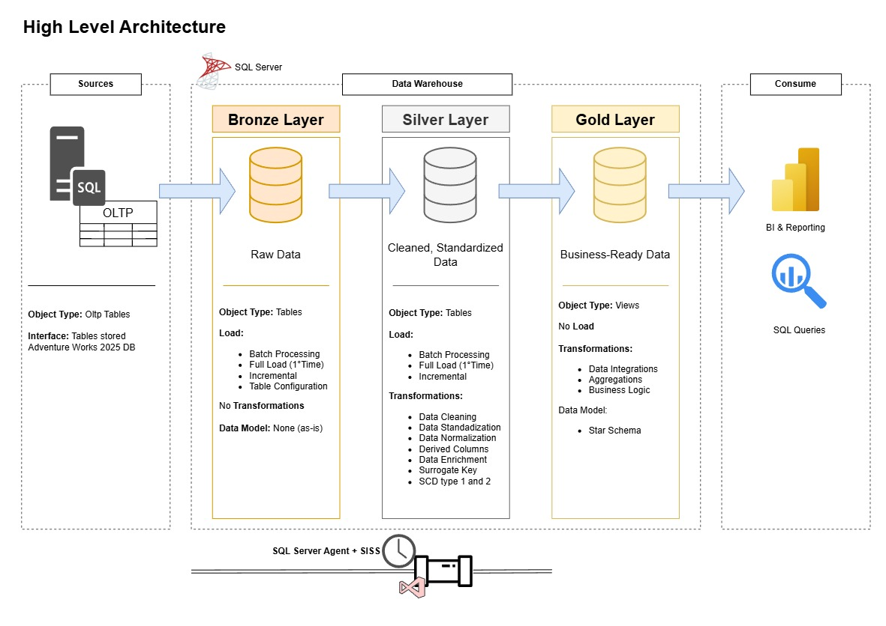

# Power-BI-Portfolio with creation of DWH in SQL (Medallion Architecture) is in progress and it will be avalaible in the end of September 2026!!!!
# Data Warehouse and Power BI Project
Hi everyone! Welcome to the **Data Warehouse and Power BI Project** repository. 
The goal of this project is to demostrate a comprehenisive data warehousing and business analitical solution, form building a data warehouse with **Microsoft SQL Server**, orchestrate by SQL Server Integration Services **SSIS** to generating insights with **Power BI**.
# 📊 Power BI Portfolio – Filippo Chiauzzi

---

## Architecture Proposal

---
## 🔥 Workflow
Raw data → Cleaning (SQL / Power Query) → Modelling (DAX) → Visualization (Power BI)

---

## 📂 Projects
### 1. AdventureWorks – Executive Sales Dashboard

- **Dataset OLTP:** AdventureWorks2025
- **Focus:** Sales performance, profitability, customer insights  
- **Tech:** Power BI, SQL Server, DAX  
